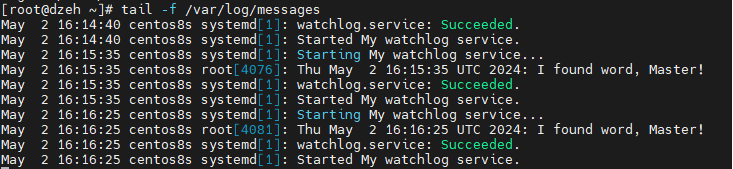
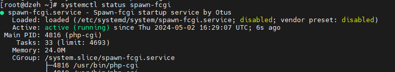
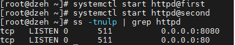

# Systemd
## Загрузка системы. Systemd
1. Для начала создаём файл с конфигурацией для сервиса в директории  **/etc/sysconfig//watchlog**
2. Создадим скрипт: **/opt/watchlog.sh**
3. Добавим права на запуск файла:  **chmod +x /opt/watchlog.sh**
4. Создадим юнит для сервиса **(watchlog.service)** и Создадим юнит для таймера **(watchlog.timer)**   юниты создаем в **/etc/systemd/system/** 
5. **systemctl reload** - заново перечитать список сервисов
6. **systemctl start watchlog.timer**
7. **tail -f /var/log/messages** проверяем вывод, что все работает
8. 
## Из epel установить spawn-fcgi и переписать init-скрипт на unit-файл. Имя сервиса должно также называться.
1. Устанавливаем spawn-fcgi и необходимые для него пакеты: ``` yum install epel-release -y && yum install spawn-fcgi php php-cli mod_fcgid httpd -y ```
2. раскомментировать строки с переменными в **/etc/sysconfig/spawn-fcgi** и создадим юнит **/etc/systemd/system/spawn-fcgi.service**
3. Убеждаемся, что все успешно работает:  ``` systemctl start spawn-fcgi  ```  ``` systemctl status spawn-fcgi  ```
4. 
5. ## Запустить несколько инстансов сервера
6. Для запуска нескольких экземпляров сервиса будем использовать шаблон в конфигурации файла окружения /usr/lib/systemd/system/httpd.service
7.  Создаем 2 файла /etc/sysconfig/httpd-first  **(содержимое файла OPTIONS=-f conf/first.conf)**   и /etc/sysconfig/httpd-second  **(содержимое файла OPTIONS=-f conf/second.conf)**
8.  ``` cp /etc/httpd/conf/httpd.conf /etc/httpd/conf/first.conf ``` 
9.  ``` cp /etc/httpd/conf/httpd.conf /etc/httpd/conf/second.conf ```
10.  Для удачного запуска во втором файле добавляем ``` PidFile /var/run/httpd-second.pid   Listen 8080 ```    
11.  Проверяем что все работает
12.  


